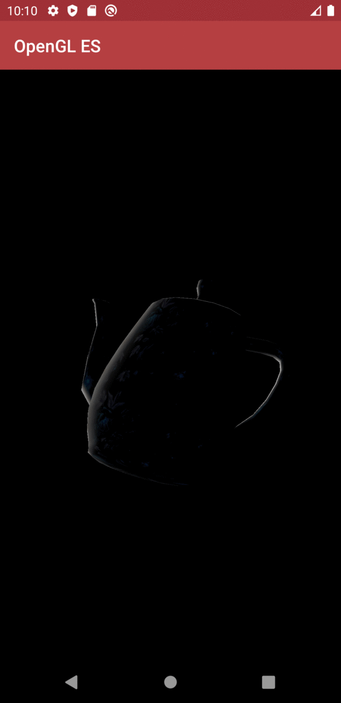

# Homework 1
The homework 1 tests your understand about spaces, transforms and vertex processing.  
Let's develop an android application with OpenGL ES SDK!

* [Procedure](#procedure)
* [Result](#result)
* [Deadline](#deadline)
* [Note](#note)

## Procedure
1. Download the files in this repository and unzip the OpenGLES_HW1.zip. 
   - (Password is required. Please check the klas information.)
2. Follow the instructions provided by GG_HW1_guide.pdf
3. Invest your time to achieve the goal!

## Result

## Deadline
* If spring class: 4.24. 23:50

## Note
* Q & A: jeunlee0306@khu.ac.kr (이정은)
* Do not use rotate() function. (e.g. glm:rotate()) 
* OpenGLES uses column major order. 
* Wrong computed normal leads weird shading (lighting) results. Please look carefully. 
* https://github.com/bisily/Teapot shows a submission example. 
* Thank you for your star.
